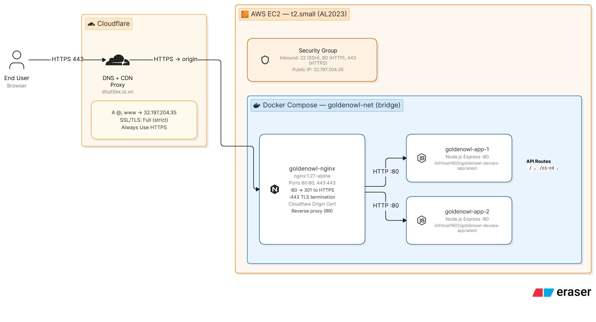
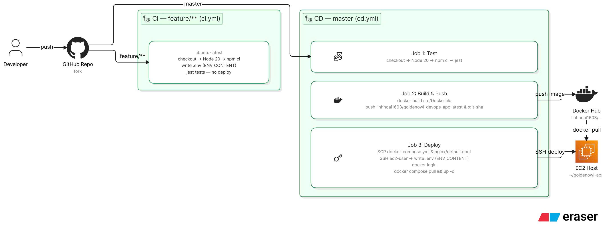

# Golden Owl DevOps Internship — Report & Operations Guide

**Live deployment:** [https://shuttlex.io.vn/](https://shuttlex.io.vn/)

Example response:

```json
{"message":"Welcome warriors to Golden Owl!"}
```

This project dockerizes a Node.js API, runs **CI on `feature`**, and **CD on `master`**: build and push to Docker Hub, then deploy on **AWS EC2** with **Docker Compose** (Nginx load balancer + two app replicas). DNS and edge TLS are handled by **Cloudflare**; the origin uses **Nginx HTTPS** with a **Cloudflare Origin Certificate**.

---

## 1. Solution summary

| Item | Choice |
|------|--------|
| Application | Express (Node.js 20), JSON API |
| App image | `src/Dockerfile` (Alpine, `PORT=80` in container) |
| Registry | Docker Hub — `linhhoai1603/goldenowl-devops-app` |
| CI | `.github/workflows/ci.yml` — tests on push/PR to `feature` / `feature/**` |
| CD | `.github/workflows/cd.yml` — on push to `master`: test → build/push → deploy stack on EC2 |
| Compute | EC2 **t2.small**, **Amazon Linux 2023** |
| Runtime on EC2 | **Docker Compose**: `nginx` + `app1` + `app2` (round-robin upstream) |
| Edge | Cloudflare DNS (proxied A records) + HTTPS to visitors |
| Origin TLS | Nginx `:443` with certs in `~/goldenowl-app/nginx/certs/` |

### API routes

| Method | Path | Response (example) |
|--------|------|---------------------|
| GET | `/` | `{"message":"Welcome warriors to Golden Owl!"}` |
| GET | `/ci-cd` | `{"message":"CI/CD is working!"}` |
| GET | `/hello` | `{"message":"Hello World!"}` |

---

## 2. Request flow (production)



*Diagram: Browser → Cloudflare (Full strict) → EC2 Nginx (443 TLS, 80 redirect) → load-balanced `app1` / `app2` (Express).*

1. User hits `https://shuttlex.io.vn` → **Cloudflare** (edge HTTPS).
2. Cloudflare forwards to the origin over **HTTPS :443** (**Full (strict)** + Origin Certificate on Nginx).
3. **Nginx** terminates TLS on **443**, proxies to **`app1`** and **`app2`** on the Compose network (round-robin).
4. Port **80** on Nginx only returns **301 → HTTPS** (no plain HTTP app traffic on origin).

---

## 3. CI/CD flow



*Diagram: `feature` → CI (Ubuntu runner, Jest) · `master` → CD (test → build/push → SCP + SSH → `docker compose` on EC2).*

| Event | Workflow | Actions |
|-------|----------|---------|
| Push/PR → `feature`, `feature/**` | **CI** | `npm ci`, optional `.env` from secret, `npm test` |
| Push → `master` | **CD** | Test again → build/push Docker Hub → copy `docker-compose.yml` + `nginx/default.conf` → SSH deploy stack |
| `workflow_dispatch` | CI or CD | Manual run |

---

## 4. GitHub Secrets

**Settings → Secrets and variables → Actions**

| Secret | Description |
|--------|-------------|
| `DOCKERHUB_USERNAME` | Docker Hub username |
| `DOCKERHUB_TOKEN` | Docker Hub access token |
| `EC2_HOST` | EC2 public IP or DNS |
| `EC2_USER` | `ec2-user` (Amazon Linux 2023) |
| `EC2_SSH_PRIVATE_KEY` | Full `.pem` private key |
| `ENV_CONTENT` | Multi-line `.env` for the app, e.g. `PORT=80` |

Example `ENV_CONTENT`:

```env
PORT=80
```

---

## 5. Docker Hub

Repository: **`goldenowl-devops-app`**

Tags on each successful CD:

- `linhhoai1603/goldenowl-devops-app:latest`
- `linhhoai1603/goldenowl-devops-app:<git-sha>`

Build context: **`src/`** (`src/Dockerfile`).

---

## 6. Production stack (Docker Compose)

File: **`docker-compose.yml`** at repo root.

| Service | Role |
|---------|------|
| `app1`, `app2` | Same image (`DOCKER_IMAGE`), internal port 80, env from `./.env` |
| `nginx` | Publishes **80** and **443**; load balances to `app1` / `app2` |

Nginx config: **`nginx/default.conf`** (upstream + HTTP→HTTPS redirect + SSL proxy).

### Origin certificates (one-time on EC2)

Place files on the server (not in git):

```text
/home/ec2-user/goldenowl-app/nginx/certs/cloudflare.crt
/home/ec2-user/goldenowl-app/nginx/certs/cloudflare.key
```

Create a **Cloudflare Origin Certificate** (SSL/TLS → Origin Server) for `shuttlex.io.vn` and `*.shuttlex.io.vn`, then save PEM/key with the names above. CD creates the `certs` directory but **does not** overwrite existing cert files.

```bash
chmod 700 ~/goldenowl-app/nginx/certs
chmod 600 ~/goldenowl-app/nginx/certs/cloudflare.*
```

---

## 7. AWS EC2 (t2.small)

### 7.1 Instance

- **AMI:** Amazon Linux 2023  
- **Type:** `t2.small`  
- **SSH user:** `ec2-user`  

**Security group (inbound):**

| Port | Purpose |
|------|---------|
| 22 | SSH (restrict source IP when possible) |
| 80 | HTTP → Nginx redirect to HTTPS |
| 443 | HTTPS → Nginx → apps |

### 7.2 One-time setup on EC2

```bash
ssh -i your-key.pem ec2-user@<EC2_PUBLIC_IP>

sudo dnf update -y
sudo dnf install -y docker docker-compose-plugin
sudo systemctl enable --now docker
sudo usermod -aG docker ec2-user
# log out and back in
docker compose version
docker run --rm hello-world
```

Add origin certs under `~/goldenowl-app/nginx/certs/` before the first Nginx start with SSL.

After **`master`** is pushed, GitHub Actions copies compose/nginx config and runs `docker compose pull && docker compose up -d` in `~/goldenowl-app`.

---

## 8. Cloudflare

Domain: **shuttlex.io.vn**

### 8.1 DNS

| Type | Name | Content | Proxy |
|------|------|---------|-------|
| A | `@` | `32.197.204.35` | Proxied |
| A | `www` | `32.197.204.35` | Proxied |

### 8.2 SSL mode

Because Nginx on the origin serves **HTTPS on 443** and redirects **HTTP → HTTPS**, set Cloudflare to:

- **SSL/TLS encryption mode:** **Full (strict)** (recommended), with the **Origin Certificate** on Nginx  

Do **not** use **Flexible** with this Nginx config (origin expects TLS on 443; port 80 is redirect-only).

Optional: **Always Use HTTPS** at the edge.

---

## 9. Run locally

### Node (no Docker)

```bash
cd src
npm i
npm test
npm start
```

Default port without `.env`: **3000** (`curl http://localhost:3000/`).

### Single container

```bash
cd src
docker build -t goldenowl-devops-app:local .
docker run -d --name goldenowl-app -p 8080:80 --env-file .env goldenowl-devops-app:local
curl http://localhost:8080/
```

### Compose stack (Nginx + 2 apps)

From repo root (requires origin certs for Nginx 443, or temporarily adjust `nginx/default.conf` for local HTTP-only testing):

```bash
cp src/.env .env
export DOCKER_IMAGE=linhhoai1603/goldenowl-devops-app:latest
docker compose pull   # or build from src by temporarily adding build: to compose
docker compose up -d
curl -k https://localhost/   # if certs present and mapped 443:443
```

---

## 10. Git workflow

```bash
git checkout -b feature/my-change
# commit ...
git push origin feature/my-change
# → CI runs tests

git checkout master
git merge feature/my-change
git push origin master
# → CD: test, push image, deploy Compose on EC2
```

Verify:

```bash
curl https://shuttlex.io.vn/
curl https://shuttlex.io.vn/ci-cd
```

---

## 11. Repository layout

```text
docs/
  production_traffic_diagram.jpg   # Architecture — production traffic
  ci_cd_pipeline_diagram.jpg       # Architecture — CI/CD pipeline
.github/workflows/
  ci.yml                 # Feature branch tests
  cd.yml                 # Master: test, Docker Hub, EC2 Compose deploy
docker-compose.yml       # nginx + app1 + app2
nginx/
  default.conf           # LB, redirect, SSL proxy
  certs/                 # cloudflare.crt / .key on server only (.gitignore)
src/
  Dockerfile
  index.js
  server/
  routes/
  tests/
```

---

## 12. Submission

- Public GitHub fork with incremental commits  
- Deployment URL: **https://shuttlex.io.vn/**  
- Architecture diagrams: [`docs/production_traffic_diagram.jpg`](docs/production_traffic_diagram.jpg), [`docs/ci_cd_pipeline_diagram.jpg`](docs/ci_cd_pipeline_diagram.jpg)  
- Implements: Docker, GitHub Actions CI/CD, Docker Hub, EC2 deploy, load-balanced Nginx, Cloudflare DNS/TLS  

---

*Golden Owl DevOps Internship — Technical Test.*
