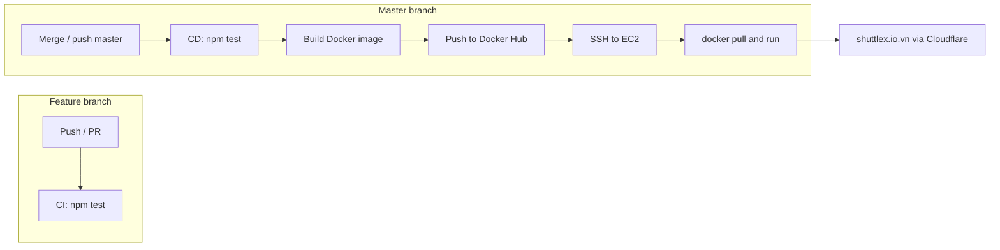

# Golden Owl DevOps Internship — Report & Operations Guide

**Deployed application:** [https://shuttlex.io.vn/](https://shuttlex.io.vn/)

```json
{"message":"Welcome warriors to Golden Owl!"}
```

This submission meets the technical test requirements: Dockerized Node.js app, CI on the `feature` branch, CD to AWS EC2 via GitHub Actions, images stored on Docker Hub, and `shuttlex.io.vn` served through Cloudflare (Flexible SSL).

---

## 1. Solution Summary

| Item | Choice |
|------|--------|
| Application | Express (Node.js 20), `GET /` returns JSON |
| Container | `src/Dockerfile` (Alpine, default port 80) |
| Registry | Docker Hub — `linhhoai1603/goldenowl-devops-app` |
| CI | Workflow `.github/workflows/ci.yml` — **tests only** on push/PR to `feature` |
| CD | Workflow `.github/workflows/cd.yml` — on **push/merge to `master`**: re-test → build & push → deploy to EC2 |
| Infrastructure | AWS EC2 **t2.small**, **Amazon Linux 2023**; Docker runs container `goldenowl-app` |
| DNS & HTTPS | Cloudflare: A records → EC2, **SSL/TLS: Flexible** |

---

## 2. CI/CD Flow



**Rules:**

- Push to `feature` or `feature/**` → **CI only** (no build, no deploy).
- Merge a PR into `master` (or push directly to `master`) → **CD runs**: tests run again on `master`; if they pass, the image is built, pushed, and deployed.

---

## 3. GitHub Actions

### 3.1 CI — `.github/workflows/ci.yml`

| Trigger | Behavior |
|---------|----------|
| `push` / `pull_request` → `feature`, `feature/**` | `npm ci` → create `.env` from `ENV_CONTENT` secret → `npm test` |
| `workflow_dispatch` | Run tests manually |

### 3.2 CD — `.github/workflows/cd.yml`

| Trigger | Behavior |
|---------|----------|
| `push` → `master` | Jobs **Test** → **Build and push image** → **Deploy to EC2** |
| `workflow_dispatch` | Manual deploy (still test → build → deploy) |

**Deploy on EC2 (summary):**

1. Write `~/goldenowl-app/.env` from `ENV_CONTENT`.
2. `docker login` → `docker pull` image `:latest`.
3. Stop/remove the old container → `docker run` with `--env-file`, map ports from `PORT` in `.env` (default 80).

---

## 4. GitHub Secrets

Configure under **Repository → Settings → Secrets and variables → Actions**:

| Secret | Description |
|--------|-------------|
| `DOCKERHUB_USERNAME` | Docker Hub username |
| `DOCKERHUB_TOKEN` | Access token (Docker Hub → Account Settings → Security) |
| `EC2_HOST` | EC2 public IPv4 or public DNS |
| `EC2_USER` | SSH user: **`ec2-user`** (Amazon Linux 2023) |
| `EC2_SSH_PRIVATE_KEY` | Full contents of the `.pem` file (EC2 key pair) |
| `ENV_CONTENT` | Full `.env` file content (multi-line), e.g. `PORT=80` |

**Example `ENV_CONTENT`:**

```env
PORT=80
```

---

## 5. Docker Hub

1. Create repository: `goldenowl-devops-app` (public or private).
2. After each successful CD run:
   - `<DOCKERHUB_USERNAME>/goldenowl-devops-app:latest`
   - `<DOCKERHUB_USERNAME>/goldenowl-devops-app:<git-sha>`

Workflow build context: `src/` directory (uses `src/Dockerfile`).

---

## 6. AWS EC2 (t2.small)

### 6.1 Create the instance

- **AMI:** Amazon Linux 2023.
- **Instance type:** `t2.small`.
- **Key pair:** download `.pem`; put contents in `EC2_SSH_PRIVATE_KEY` secret.
- **Security group (inbound):**

| Port | Protocol | Source | Notes |
|------|----------|--------|-------|
| 22 | TCP | Your IP / (temporarily `0.0.0.0/0` if deploying via GitHub Actions) | SSH |
| 80 | TCP | `0.0.0.0/0` | HTTP app (Cloudflare Flexible → origin HTTP) |

### 6.2 Install Docker on EC2 (Amazon Linux 2023)

First SSH session:

```bash
ssh -i your-key.pem ec2-user@<EC2_PUBLIC_IP>
```

Install Docker ( `docker` package from Amazon Linux repos):

```bash
sudo dnf update -y
sudo dnf install -y docker
sudo systemctl enable --now docker
sudo usermod -aG docker ec2-user
```

Log out and SSH back in (or run `newgrp docker`), then verify:

```bash
docker run --rm hello-world
```

Set GitHub secret **`EC2_USER`** to `ec2-user`.

After this, each merge to `master` triggers GitHub Actions to SSH into EC2 and pull/run the image.

---

## 7. Cloudflare — DNS & Flexible SSL

Domain: **shuttlex.io.vn**

### 7.1 DNS

In Cloudflare → **DNS → Records** (actual configuration example):

| Type | Name | Content | Proxy status | TTL |
|------|------|---------|--------------|-----|
| A | `@` (`shuttlex.io.vn`) | `32.197.204.35` | Proxied | Auto |
| A | `www` | `32.197.204.35` | Proxied | Auto |

- **`@`**: apex domain `https://shuttlex.io.vn`
- **`www`**: subdomain `https://www.shuttlex.io.vn` (same EC2 origin)

Wait for DNS propagation.

### 7.2 SSL/TLS Flexible

**SSL/TLS → Overview → Encryption mode:** **Flexible**

- Browser ↔ Cloudflare: **HTTPS**
- Cloudflare ↔ EC2: **HTTP** (port 80)

EC2 only needs port **80** open; the container listens on `PORT=80`. No Let's Encrypt certificate on the origin is required when using Flexible mode.

---

## 8. Run the application locally (without Docker)

```bash
cd src
npm i
npm test
npm start
```

Without a `.env` file, the app listens on port **3000** by default:

```bash
curl http://localhost:3000/
```

With `src/.env` containing `PORT=80`, use that port instead.

---

## 9. Build & run Docker locally

From the `src` directory:

```bash
docker build -t goldenowl-devops-app:local .
docker run -d --name goldenowl-app -p 80:80 --env-file .env goldenowl-devops-app:local
curl http://localhost/
```

---

## 10. Recommended workflow

```bash
# Develop on feature
git checkout -b feature/...
# ... commit ...
git push origin feature/...
# → GitHub runs CI (tests)

# When ready, merge to master (PR or local merge)
git checkout master
git merge feature
git push origin master
# → GitHub runs CD: test → build/push Docker Hub → deploy EC2
```

Verify production:

```bash
curl https://shuttlex.io.vn/
```

---

## 11. DevOps-related repository layout

```text
.github/workflows/
  ci.yml          # Tests on feature
  cd.yml          # Test + Docker Hub + EC2 on master
src/
  Dockerfile
  index.js        # dotenv + listen PORT
  server/
  routes/
  tests/
```

---

## 12. Submission

- Public GitHub repository (personal fork).
- Deployment URL: **https://shuttlex.io.vn/**
- Commit in stages (Dockerfile → CI → CD → README) to show clear progress.

---

*Golden Owl DevOps Internship — Technical Test. Infrastructure as code, automated CI/CD.*
